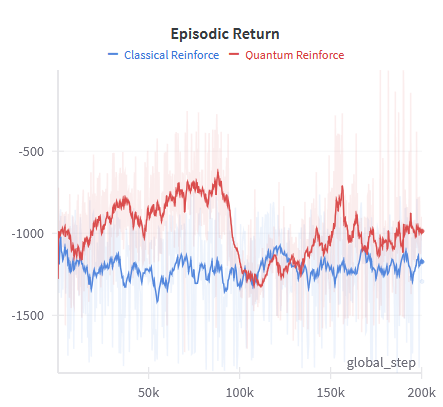
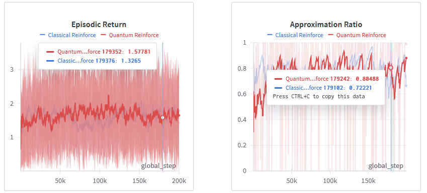

# REINFORCE

REINFORCE is a Monte Carlo policy gradient algorithm that directly optimizes the policy parameters by estimating the gradient of the expected cumulative reward. This estimation is achieved through trajectory sampling and the application of the policy gradient theorem. For details, see the original paper [Policy Gradient Methods for Reinforcement Learning with Function Approximation](https://proceedings.neurips.cc/paper_files/paper/1999/file/464d828b85b0bed98e80ade0a5c43b0f-Paper.pdf). In our implementation, we follow the steps of the paper by Jerbi [Parametrized Quantum Policies for Reinforcement Learning](https://proceedings.neurips.cc/paper/2021/file/eec96a7f788e88184c0e713456026f3f-Paper.pdf).

## Continuous state - discrete action    

The [```reinforce_classical.py```](https://github.com/fhg-iisb-mki/cleanqrl/blob/main/cleanqrl/reinforce_classical.py) and the [```reinforce_quantum.py```](https://github.com/fhg-iisb-mki/cleanqrl/blob/main/cleanqrl/reinforce_quantum.py) have the following features:

* ✅ Work with the Box observation space of low-level features
* ✅ Work with the discrete action space
* ✅ Work with envs like [CartPole-v1](https://gymnasium.farama.org/environments/classic_control/cart_pole/)
* ✅ Multiple Vectorized Environments 
* ✅ Single file implementation 

### Implementation details

The key difference between the classical and the quantum algorithm is the ```ReinforceAgentQuantum``` class, as shown below

<div style="display: flex;">
  <span style="width: 50%;">
    ```py title="reinforce_quantum.py" linenums="1"
    class ReinforceAgentQuantum(nn.Module):
        def __init__(self, observation_size, num_actions, config):
            super().__init__()
            self.config = config
            self.observation_size = observation_size
            self.num_actions = num_actions
            self.num_qubits = config["num_qubits"]
            self.num_layers = config["num_layers"]
            # input and output scaling are always initialized as ones
            self.input_scaling = nn.Parameter(
                torch.ones(self.num_layers, self.num_qubits), requires_grad=True
            )
            self.output_scaling = nn.Parameter(
                torch.ones(self.num_actions), requires_grad=True
            )
            # trainable weights are initialized randomly between -pi and pi
            self.weights = nn.Parameter(
                torch.FloatTensor(self.num_layers, self.num_qubits*2)
                .uniform_(-np.pi, np.pi),
                requires_grad=True,
            )
            device = qml.device(config["device"], wires=range(self.num_qubits))
            self.quantum_circuit = qml.QNode(
                parameterized_quantum_circuit,
                device,
                diff_method=config["diff_method"],
                interface="torch",
            )
    ```
  </span>
  <span style="width: 51%;">
    ```py title="reinforce_classical.py" linenums="1"
    class ReinforceAgentClassical(nn.Module):
        def __init__(self, observation_size, num_actions):
            super().__init__()
            self.network = nn.Sequential(
                nn.Linear(observation_size, 64),
                nn.ReLU(),
                nn.Linear(64, 64),
                nn.ReLU(),
                nn.Linear(64, num_actions),
            )
    ```
  </span>
</div>

<div style="display: flex;">
  <span style="width: 50%;">
    ```py title="reinforce_quantum.py"
    def get_action_and_logprob(self, x):
        logits = self.quantum_circuit(
            x,
            self.input_scaling,
            self.weights,
            self.num_qubits,
            self.num_layers,
            self.num_actions,
            self.observation_size,
        )
        logits = torch.stack(logits, dim=1)
        logits = logits * self.output_scaling
        probs = Categorical(logits=logits)
        action = probs.sample()
        return action, probs.log_prob(action)
    ```
  </span>
 <span style="width: 50%;">
    ```py title="reinforce_classical.py"
    def get_action_and_logprob(self, x):
        logits = self.network(x)
        probs = Categorical(logits=logits)
        action = probs.sample()
        return action, probs.log_prob(action)
    ```
  </span>
</div>

Additionally, we also need to specify a function for the ansatz of the parameterized quantum circuit. 

```py title="reinforce_quantum.py" linenums="1"
def parameterized_quantum_circuit(
    x, input_scaling, weights, num_qubits, num_layers, num_actions, observation_size
):
    for layer in range(num_layers):
        for i in range(observation_size):
            qml.RX(input_scaling[layer, i] * x[:, i], wires=[i])

        for i in range(num_qubits):
            qml.RY(weights[layer, i], wires=[i])

        for i in range(num_qubits):
            qml.RZ(weights[layer, i + num_qubits], wires=[i])

        if num_qubits == 2:
            qml.CZ(wires=[0, 1])
        else:
            for i in range(num_qubits):
                qml.CZ(wires=[i, (i + 1) % num_qubits])

    return [qml.expval(qml.PauliZ(wires=i)) for i in range(num_actions)]
```

The ansatz of this parameterized quantum circuit is taken from the publication of by Skolik et al [Quantum agents in the Gym](https://quantum-journal.org/papers/q-2022-05-24-720/pdf/). The ansatz is also depicted in the figure below:

Our implementation incorporates some key novelties proposed by Skolik:

* ```data reuploading```: In our ansatz, the features of the states are encoded via RX rotation gates. Instead of only encoding the features in the first layer, this process is repeated in each layer. This has shown to improve training performance.
* ```input scaling```: In our implementation, we define another set of trainable parameters that scale the features that are encoded into the quantum circuits. This has also been shown to improve training performance.
* ```output scaling```: In our implementation, we define a final set of hyperparameters that scales the expectation values that the quantum circuit "outputs". This has also been shown to improve training performance.

We also provide the option to select different ```learning rates``` for the different parameter sets:

```py title="reinforce_quantum.py"
    optimizer = optim.Adam(
        [
            {"params": agent.input_scaling, "lr": lr_input_scaling},
            {"params": agent.output_scaling, "lr": lr_output_scaling},
            {"params": agent.weights, "lr": lr_weights},
        ]
    )
```

Also, you can use a faster pennylane backend for your simulations:

* ```pennylane-lightning```: We enable the use of the ```lightning``` simulation backend by pennylane, which speeds up simulation 

We also add an observation wrapper called ```ArctanNormalizationWrapper``` at the very beginning of the file. Because we encode the features of the states as rotations, we need to ensure that the features are not beyond the interval of - π and π due to the periodicity of the rotation gates. For more details on wrappers, see [Advanced Usage](https://fhg-iisb-mki.github.io/cleanqrl-docs/advanced_usage/jumanji_environments/).


### Experiment results

We evaluated our implementation on the following environments:

|  |  |
|:--:|:--:|
| Cartpole-v1 | Acrobot-v1 |

For more information see the [configs folder](https://github.com/FhG-IISB-MKI/cleanqrl/tree/main/configs) and the weights&biases reports in the [Benchmarks section](/benchmarks/overview/).

## Continuous state - continuous action    

The [```reinforce_classical_continuous_action.py```](https://github.com/fhg-iisb-mki/cleanqrl/blob/main/cleanqrl/reinforce_classical_continuous_action.py) and the [```reinforce_quantum_continuous_action.py```](https://github.com/fhg-iisb-mki/cleanqrl/blob/main/cleanqrl/reinforce_quantum_continuous_action.py) have the following features:

* ✅ Work with the continuous observation space 
* ✅ Work with the continuous action space
* ✅ Work with envs like [Pendulum-v1](https://gymnasium.farama.org/environments/classic_control/pendulum/)
* ✅ Multiple Vectorized Environments 
* ✅ Single file implementation 

### Implementation details

The implementations follow the same principles as [```reinforce_classical.py```](https://github.com/fhg-iisb-mki/cleanqrl/blob/main/cleanqrl/reinforce_classical.py) and [```reinforce_quantum.py```](https://github.com/fhg-iisb-mki/cleanqrl/blob/main/cleanqrl/reinforce_quantum.py). In the following we focus on the key differences between [```reinforce_quantum_continuous_action.py```](https://github.com/fhg-iisb-mki/cleanqrl/blob/main/cleanqrl/reinforce_quantum_continuous_action.py) and [```reinforce_quantum.py```](https://github.com/fhg-iisb-mki/cleanqrl/blob/main/cleanqrl/reinforce_quantum_continuous_action.py). The same differences also apply for the classical implementations.

While the state encoding is the same as for the previous approach, we need to implement some modifications in order to draw continuous actions with the parameterized quantum circuit. For that we modify the ```ReinforceAgentQuantum``` class as follows:

```py title="reinforce_quantum_continuous_action.py" hl_lines="14 17-30"

class ReinforceAgentQuantumContinuous(nn.Module):
    def __init__(self, observation_size, num_actions, config):
        super().__init__()
        self.config = config
        self.observation_size = observation_size
        self.num_actions = num_actions
        self.num_qubits = config["num_qubits"]
        self.num_layers = config["num_layers"]

        .....


        # additional trainable parameters for the variance of the continuous actions
        self.actor_logstd = nn.Parameter(torch.zeros(1, num_actions))

    def get_action_and_logprob(self, x):
        action_mean = self.quantum_circuit(
            x,
            self.input_scaling,
            self.weights,
            self.num_qubits,
            self.num_layers,
            self.num_actions,
            self.observation_size,
        )
        action_mean = torch.stack(action_mean, dim=1)
        action_mean = action_mean * self.output_scaling
        action_logstd = self.actor_logstd.expand_as(action_mean)
        action_std = torch.exp(action_logstd)
        probs = torch.distributions.Normal(action_mean, action_std)
        action = probs.sample()
        return action, probs.log_prob(action)
```

In our implementation, the mean of the continuous action is based on the expectation value of the parameterized quantum circuit, while the variance is an additional classical trainable parameter. This parameter is also the same for all continuous actions. For additional information we refer to [Variational Quantum Circuit Design for Quantum Reinforcement Learning on Continuous Environments](https://arxiv.org/pdf/2312.13798)


### Experiment results

We evaluated our implementation on the following environments:

| 
|:--:|
| Pendulum-v1 |

For more information see the [configs folder](https://github.com/FhG-IISB-MKI/cleanqrl/tree/main/configs) and the weights&biases reports in the [Benchmarks section](/benchmarks/overview/).


## Discrete state - discrete action    

The [```reinforce_classical_discrete_state.py```](https://github.com/fhg-iisb-mki/cleanqrl/blob/main/cleanqrl/reinforce_classical_discrete_state.py) and the [```reinforce_quantum_discrete_state.py```](https://github.com/fhg-iisb-mki/cleanqrl/blob/main/cleanqrl/reinforce_quantum_discrete_state.py) have the following features:

* ✅ Work with the discrete observation space 
* ✅ Work with the discrete action space
* ✅ Work with envs like [FrozenLake-v1](https://gymnasium.farama.org/environments/toy_text/frozen_lake/)
* ✅ Multiple Vectorized Environments 
* ✅ Single file implementation 

### Implementation details

The implementations follow the same principles as [```reinforce_classical.py```](https://github.com/fhg-iisb-mki/cleanqrl/blob/main/cleanqrl/reinforce_classical.py) and [```reinforce_quantum.py```](https://github.com/fhg-iisb-mki/cleanqrl/blob/main/cleanqrl/reinforce_quantum.py). In the following we focus on the key differences between [```reinforce_quantum_discrete_state.py```](https://github.com/fhg-iisb-mki/cleanqrl/blob/main/cleanqrl/reinforce_quantum_discrete_state.py) and [```reinforce_quantum.py```](https://github.com/fhg-iisb-mki/cleanqrl/blob/main/cleanqrl/reinforce_quantum.py). The same differences also apply for the classical implementations.

The key difference is the state encoding. Since discrete state environments like FrozenLake return an integer value, it is straight forward to encode the state as a binary value instead of an integer. For that, an additional function for ```ReinforceAgentQuantum``` is added called ```encoding_input```. This converts the integer value into its binary value.

```py title="reinforce_quantum_discrete_state.py"
    def encode_input(self, x):
        x_binary = torch.zeros((x.shape[0], self.observation_size))
        for i, val in enumerate(x):
            binary = bin(int(val.item()))[2:]
            padded = binary.zfill(self.observation_size)
            x_binary[i] = torch.tensor([int(bit) * np.pi for bit in padded])
        return x_binary
```
Now we just need to also call this function before we pass the input to the parameterized quantum circuit:

```py title="reinforce_quantum_discrete_state.py" hl_lines="2 4"
    def get_action_and_logprob(self, x):
        x_encoded = self.encode_input(x)
        logits = self.quantum_circuit(
            x_encoded,
            self.input_scaling,
            self.weights,
            self.num_qubits,
            self.num_layers,
            self.num_actions,
            self.observation_size
        )
        logits = torch.stack(logits, dim=1)
        logits = logits * self.output_scaling
        probs = Categorical(logits=logits)
        action = probs.sample()
        return action, probs.log_prob(action)

```
### Experiment results

We evaluated our implementation on the following environments:

| 
|:--:|
| FrozenLake-v1 (is_slippery=False) |

For more information see the [configs folder](https://github.com/FhG-IISB-MKI/cleanqrl/tree/main/configs) and the weights&biases reports in the [Benchmarks section](/benchmarks/overview/).

## Jumanji Environments    

The [```reinforce_classical_jumanji.py```](https://github.com/fhg-iisb-mki/cleanqrl/blob/main/cleanqrl/reinforce_classical_jumanji.py) and the [```reinforce_quantum_jumanji.py```](https://github.com/fhg-iisb-mki/cleanqrl/blob/main/cleanqrl/reinforce_quantum_jumanji.py) have the following features:

* ✅ Work with [jumanji](https://github.com/instadeepai/jumanji) environments 
* ✅ Work with envs like [Traveling Salesperson](https://instadeepai.github.io/jumanji/environments/tsp/) and [Knapsack](https://instadeepai.github.io/jumanji/environments/knapsack/)
* ✅ Multiple Vectorized Environments 
* ❌ No single file implementation (require custom wrapper file for jumanji ```jumanji_wrapper.py```)

### Implementation details

The implementations follow the same principles as [```reinforce_classical.py```](https://github.com/fhg-iisb-mki/cleanqrl/blob/main/cleanqrl/reinforce_classical.py) and [```reinforce_quantum.py```](https://github.com/fhg-iisb-mki/cleanqrl/blob/main/cleanqrl/reinforce_quantum.py). In the following we focus on the key differences between [```reinforce_quantum_jumanji.py```](https://github.com/fhg-iisb-mki/cleanqrl/blob/main/cleanqrl/reinforce_quantum_jumanji.py) and [```reinforce_quantum.py```](https://github.com/fhg-iisb-mki/cleanqrl/blob/main/cleanqrl/reinforce_quantum.py). The same differences also apply for the classical implementations.

For most of the ```jumanji`` environments, the observation space is quite complex. Instead of simple numpy arrays for the states, we often have dictionary states which vary in size and shape. E.g. the Knapsack problem returns a state of shape 

* ```weights```: jax array (float) of shape (num_items,), array of weights of the items to be packed into the knapsack.
* ```values```: jax array (float) of shape (num_items,), array of values of the items to be packed into the knapsack.
* ```packed_items```: jax array (bool) of shape (num_items,), array of binary values denoting which items are already packed into the knapsack.
* ```action_mask```: jax array (bool) of shape (num_items,), array of binary values denoting which items can be packed into the knapsack.

In order to parse this to a parameterized quantum circuit or a neural network, we can use a gym wrapper which converters the state again to an array. This is being done when calling the function ```create_jumanji_wrapper```. For more details see [Jumanji Wrapper](https://fhg-iisb-mki.github.io/cleanqrl-docs/advanced_usage/jumanji_environments/). 

```py title="reinforce_quantum_jumanji.py" hl_lines="3"

def make_env(env_id, config):
    def thunk():
        env = create_jumanji_env(env_id, config)

        return env

    return thunk
```

```py title="reinforce_quantum_jumanji.py" hl_lines="2 8"
class ReinforceAgentQuantum(nn.Module):
    def __init__(self, num_actions, config):
        super().__init__()
        self.config = config
        self.num_actions = num_actions
        self.num_qubits = config["num_qubits"]
        self.num_layers = config["num_layers"]
        self.block_size = 3  # number of subblocks depends on environment
```

Because the state is now growing quickly in size as the number of items of the Knapsack is increased, we use a slightly different approach to encode it: Instead of encoding each feature of the state on an individual qubit, we divide the state again into 3 blocks, namely ```weights```, ```values```and ```packed_items```. This will be important for the modification of our ansatz for the parameterized quantum circuit which you can see below:

```py title="reinforce_quantum_jumanji.py" hl_lines="9-11 14-22"
def parametrized_quantum_circuit(
    x, input_scaling, weights, num_qubits, num_layers, num_actions
):

    # This block needs to be adapted depending on the environment.
    # The input vector is of shape [4*num_actions] for the Knapsack:
    # [action mask, packed items, values, weights]

    annotations = x[:, num_qubits : num_qubits * 2]
    values_kp = x[:, num_qubits * 2 : num_qubits * 3]
    weights_kp = x[:, 3*num_qubits:]

    for layer in range(num_layers):
        for block, features in enumerate([annotations, values_kp, weights_kp]):
            for i in range(num_qubits):
                qml.RX(input_scaling[layer, block, i] * features[:, i], wires=[i])

            for i in range(num_qubits):
                qml.RY(weights[layer, block, i], wires=[i])

            for i in range(num_qubits):
                qml.RZ(weights[layer, block, i+num_qubits], wires=[i])
        
            if num_qubits == 2:
                qml.CZ(wires=[0, 1])
            else:
                for i in range(num_qubits):
                    qml.CZ(wires=[i, (i + 1) % num_qubits])

    return [qml.expval(qml.PauliZ(wires=i)) for i in range(num_actions)]
```

We encode each of these blocks individually in each layer. By that, we can save quantum circuit width, so the number of qubits, by increasing our quantum circuit depth, so the number of gates we are using. However, this still is not an optimal encoding. See our [**Tutorials**](https://fhg-iisb-mki.github.io/cleanqrl-docs/tutorials/overview/) section for better ansatz design.

### Experiment results

We evaluated our implementation on the following environments:

| 
|:--:|
| Knapsack |

| 
|:--:|
| TSP |

For more information see the [configs folder](https://github.com/FhG-IISB-MKI/cleanqrl/tree/main/configs) and the weights&biases reports in the [Benchmarks section](/benchmarks/overview/).
