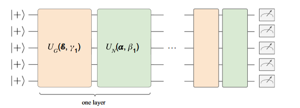

# Graph Encoding

In this tutorial, we will introduce the implementation of [Equivariant quantum circuits for learning on weighted graphs](https://www.nature.com/articles/s41534-023-00710-y) by Andreas Skolik et al. In her work, she proposes a new ansatz for quantum circuits that is equivariant under node permutations. This is particularly useful for problems on graphs, such as the Traveling Salesperson Problem (TSP). The authors show that their ansatz can be used to learn heuristics for the TSP using reinforcement learning. In this tutorial, we will implement this method as described in said paper.

The RL environment for the TSP described in the original paper is defined by the following key elements:
 - The state space consists of annotated graphs representing the current partial tour. Nodes are marked to indicate if they are already in the tour
 - The action space involves selecting the next node (city) to add to the partial tour from the available nodes
 - The reward function is determined by the reduction in the total length of the partial tour after adding a new node. A shorter tour (negative cost change) yields a positive reward

In our example however, we use the implementation of jumanji, which deviates slighty. For more information see the [jumanji documentation](https://instadeepai.github.io/jumanji/environments/tsp/).


A parametrized quantum circuit (PQC), specifically the equivariant quantum circuit (EQC) introduced in this work, is used as the Q-function approximator. The EQC is designed to respect the symmetry of equivariance under node permutations, which is considered advantageous for learning tasks on graphs. 

The EQC requires only a linear scaling of qubits with the number of cities,  which is superior to the quadratic scaling often needed for TSP in QAOA.

The ansatz is defined as the ansatz from QAOA. The distances between the nodes of the graph are encoded in the two-qubit gates, while the annotations are encoded in the single-qubit gates, see the next Figure:




In this tutorial, we implement this ansatz in the `graph_encoding_ansatz` function. The function takes the following parameters:
- `x`: The input data, which contains the distances between the nodes and the annotations
- `input_scaling`: The scaling factor for the input data, which is a learnable parameter
- `weights`: The weights of the single-qubit gates, which are also learnable parameters
- `num_qubits`: The number of qubits in the circuit, which is equal to the number of nodes in the graph
- `num_layers`: The number of layers in the circuit, which is a hyperparameter
- `num_actions`: The number of actions in the action space, which is equal to the number of nodes in the graph

```py
def graph_encoding_ansatz(x, input_scaling, weights, num_qubits, num_layers, num_actions):

    distances = torch.from_numpy(calculate_city_distances(x[:, num_actions: num_actions+num_actions*2], num_actions))
    annotations_mask = x[:, :num_actions]
    annotations = torch.zeros_like(annotations_mask, dtype=float)
    # Set values to 0 if negative, π if positive
    annotations[annotations_mask > 0] = torch.pi

    # Apply the initial layer of Hadamard gates to all qubits
    for i in range(num_qubits):
        qml.Hadamard(wires=i)

    for layer in range(num_layers):
        idx = 0
        for i in range(num_qubits):
            for j in range(i + 1, num_actions):
                qml.CNOT(wires=[i, j])
                qml.RZ(input_scaling[layer] * distances[:, idx], wires=j)
                qml.CNOT(wires=[i, j])
                idx += 1

        for i in range(num_qubits):
            qml.RX(weights[layer]*annotations[:, i], wires=i)

    return [qml.expval(qml.PauliX(i)) for i in range(num_actions)]
```

Here we need to compute the distances between the cities and the annotations. The distances are computed using the function `calculate_city_distances`.

```py
def calculate_city_distances(city_coordinates, num_cities):
    batch_size = city_coordinates.shape[0]
    pairwise_distances = np.zeros((batch_size, sum(range(num_cities))))
    for batch_idx in range(batch_size):
        idx = 0
        for i in range(num_cities):
            for j in range(i + 1, num_cities):  # Only calculate upper triangle
                distance = np.linalg.norm(
                    np.asarray(city_coordinates[batch_idx, i]) - np.asarray(city_coordinates[batch_idx, j])
                )
                # Set distance for both directions
                pairwise_distances[batch_idx, idx] = distance
                idx += 1
    return pairwise_distances
``` 

The annotations are set to 0 if negative and π if positive. The rest of the code is similar to the standard encoding. However, the number of parameters is greatly reduced. Instead of having `block_size * num_qubits * num_layers` parameters, we only have `num_layers` parameters.

<div style="display: flex;">
  <span style="width: 50%;">

```py
self.input_scaling = nn.Parameter(
    torch.ones(self.num_layers),
    requires_grad=True,
)
self.output_scaling = nn.Parameter(
    torch.ones(self.num_actions), requires_grad=True
)
self.weights = nn.Parameter(
    torch.ones(self.num_layers),
    requires_grad=True,
)
```
</span>
<span style="width: 51%;">

```py
self.input_scaling = nn.Parameter(
    torch.ones(self.num_layers, self.block_size, self.num_qubits),
    requires_grad=True,
)
self.output_scaling = nn.Parameter(
    torch.ones(self.num_actions), requires_grad=True
)
self.weights = nn.Parameter(
    torch.FloatTensor(
        self.num_layers, self.block_size, self.num_qubits * 2
    ).uniform_(-np.pi, np.pi),
    requires_grad=True,
)
```
  </span>
</div>

As can be seen, the adaptation of the cleanqrl implementation is straightforward. The whole script can be found in the tutorial folder under [`graph_encoding.py`](https://github.com/FhG-IISB-MKI/cleanqrl/blob/main/tutorials/graph_encoding.py). 