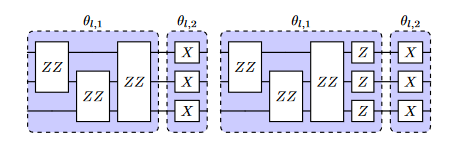

# Hamiltonian Encoding

The paper [Hamiltonian-based Quantum Reinforcement Learning for Neural Combinatorial Optimization](https://arxiv.org/abs/2405.07790) introduces a novel approach to Quantum Reinforcement Learning (QRL) specifically designed for binary combinatorial optimization (CO) problems.

The core innovation of this work in the context of RL is the replacement of the classical neural network, typically used as a function approximator in RL, with a Variational Quantum Circuit (VQC) where the the architecture of the VQC (the ansatz) is directly inspired by the problem Hamiltonian of the binary CO problem being addressed, particularly its QUBO (Quadratic Unconstrained Binary Optimization) formulation
. This is a departure from using problem-agnostic, hardware-efficient ansatzes (HEAs).

In essence, the paper integrates problem-specific quantum circuits, derived from the Hamiltonian of CO problems, into standard reinforcement learning algorithms. The RL framework provides the learning mechanism to optimize the parameters of these quantum circuits to find good solutions to the given combinatorial problems




The integration of this ansatz into the cleanqrl library is quite simple and the whole implementation can be found in the file [`hamiltonian_encoding.py`](https://github.com/FhG-IISB-MKI/cleanqrl/blob/main/tutorials/hamiltonian_encoding.py). First, the ansatz is defined in the function `hamiltonian_encoding_ansatz` and takes the following parameters:

- `x`: The input data, which contains the distances between the nodes and the annotations
- `input_scaling`: The scaling factor for the input data, which is a learnable parameter
- `weights`: The weights of the single qubit gates, which are also learnable parameters
- `num_qubits`: The number of qubits in the circuit, which is equal to the number of nodes in the graph
- `num_layers`: The number of layers in the circuit, which is a hyperparameter
- `num_actions`: The number of actions in the action space, which is equal to the number of nodes in the graph

```py
# QUANTUM CIRCUIT: This function contains the key differenz to the standard apporach
def hamiltonian_encoding_ansatz(x, input_scaling, weights, num_qubits, num_layers, num_actions):

    annotations_mask = x[:, :num_actions]
    annotations = torch.zeros_like(annotations_mask, dtype=float)
    # Set values to 0 if negative, π if positive
    annotations[annotations_mask > 0] = torch.pi

    h = x[:, :num_actions]
    J = x[:, num_actions:]

    for i in range(num_qubits):
        qml.Hadamard(wires=i)

    # repeat p layers the circuit shown in Fig. 1
    for layer in range(num_layers):
        # ---------- COST HAMILTONIAN ----------
        for idx_h in range(num_qubits):  # single-qubit terms
            qml.RZ(input_scaling[layer] * h[:, idx_h], wires=idx_h)

        idx_J = 0
        for i in range(num_qubits):
            for j in range(i + 1, num_actions):
                qml.CNOT(wires=[i, j])
                qml.RZ(input_scaling[layer] * J[:, idx_J], wires=j)
                qml.CNOT(wires=[i, j])
                idx_J += 1

        # ---------- MIXER HAMILTONIAN ----------
        for i in range(num_qubits):
            qml.RX(weights[layer]*annotations[:, i], wires=i)

    return [qml.expval(qml.PauliZ(i)) for i in range(num_actions)]
```

Here we need to compute the distances between the cities and the annotations. The distances are computed using the function `calculate_city_distances`. The annotations are set to 0 if negative and π if positive. The rest of the code is similar to the standard encoding. However, the number of parameters is greatly reduced. Instead of having `block_size * num_qubits * num_layers` parameters, we only have `num_layers` parameters.

Note that the hamiltonian encoding and the graph encoding methods from the previous tutorial are quite similar. In our [paper](https://arxiv.org/abs/2405.07790) we go into detail on the differences and similarities between both methods. If you are interested, please consider reading that paper!

<div style="display: flex;">
  <span style="width: 50%;">

```py
self.input_scaling = nn.Parameter(
    torch.ones(self.num_layers),
    requires_grad=True,
)
self.output_scaling = nn.Parameter(
    torch.ones(self.num_actions), requires_grad=True
)
self.weights = nn.Parameter(
    torch.ones(self.num_layers),
    requires_grad=True,
)
```
</span>
<span style="width: 51%;">

```py
self.input_scaling = nn.Parameter(
    torch.ones(self.num_layers, self.block_size, self.num_qubits),
    requires_grad=True,
)
self.output_scaling = nn.Parameter(
    torch.ones(self.num_actions), requires_grad=True
)
self.weights = nn.Parameter(
    torch.FloatTensor(
        self.num_layers, self.block_size, self.num_qubits * 2
    ).uniform_(-np.pi, np.pi),
    requires_grad=True,
)
```
  </span>
</div>


As can be seen, the adaptation of the cleanqrl implementation is straightforward. The whole script can be found in the tutorial folder. The script is called [`hamiltonian_encoding.py`](https://github.com/FhG-IISB-MKI/cleanqrl/blob/main/tutorials/hamiltonian_encoding.py). 