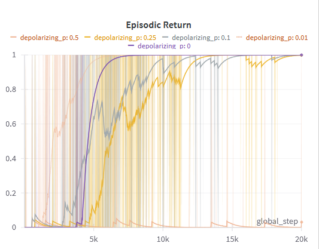

# Noise models

In this tutorial, we will show how easy it is to implement noise with pennylane and CleanQRL. We will implement a simple noise model that adds depolarizing noise to the quantum circuit. For more information on noise models, see the [pennylane documentation](https://pennylane.ai/qml/demos/tutorial_how_to_use_noise_models).

To include the noise model in the quantum circuit, we will need to add the depolarizing channel to our ansatz and add the magnitude of the depolarizing noise as an additional parameter to the function.


```py title="noise_model.py" hl_lines="4 22-24"
# QUANTUM CIRCUIT: define your ansatz here:
def parameterized_quantum_circuit(
    x, input_scaling, weights, num_qubits, num_layers, num_actions, observation_size,
    depolarizing_p
):
    for layer in range(num_layers):
        for i in range(observation_size):
            qml.RX(input_scaling[layer, i] * x[:, i], wires=[i])

        for i in range(num_qubits):
            qml.RZ(weights[layer, i], wires=[i])

        for i in range(num_qubits):
            qml.RY(weights[layer, i + num_qubits], wires=[i])

        if num_qubits == 2:
            qml.CZ(wires=[0, 1])
        else:
            for i in range(num_qubits):
                qml.CZ(wires=[i, (i + 1) % num_qubits])
    
        # Add depolarizing noise after every layer
        for i in range(num_qubits):
            qml.DepolarizingChannel(p = depolarizing_p, wires=[i])

    return [qml.expval(qml.PauliZ(wires=i)) for i in range(num_actions)]
```

And that's already it! You will only need to add the `depolarizing_p` parameter to the `get_action_and_logprob` function in the `Agent` class and to the class itself. The rest of the code will remain unchanged. Now we can test how sensitive our algorithm is to depolarizing noise by sampling different values for `depolarizing_p`. We can do a grid search:

```yaml title="noise_models.yaml"

# Noise Model parameters
depolarizing_p:       
  - grid_search
  - float
  - [0.0, 0.01, 0.1, 0.25, 0.5]
```


The result of the experiment is shown below:



As can be seen, the algorithm is not too sensitive to depolarizing noise. The performance is still quite good even for relatively high values of `depolarizing_p`.and the performance only drops significantly for `depolarizing_p = 0.5`. 
